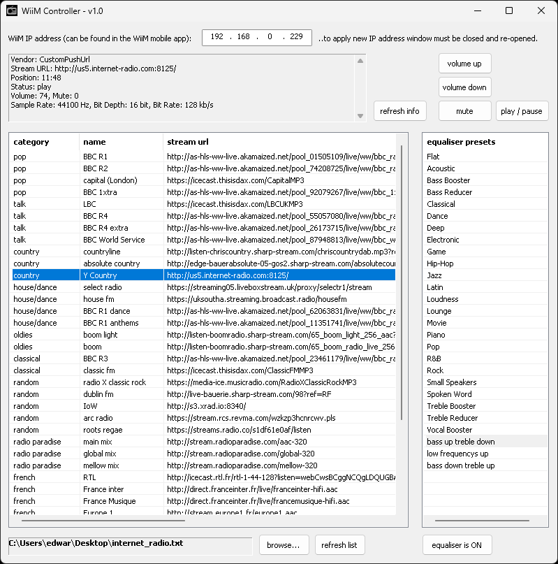

# WiiMController

- Windows desktop app for playing audio on WiiM devices from custom stream URLs, such as internet radio stations or podcasts.
- Import a list of custom stream URLs into the app.
- Basic player controls and equaliser preset selection.

I created this app because this functionality does not currently exist in the official WiiM desktop app. In the WiiM mobile app it does exist and is called 'Open Network Stream'. However, when sitting at your computer it’s more convenient to control your WiiM device directly from the desktop rather than reaching for your smartphone.

## Prerequisites
- Visual Studio - include the Desktop C++ workload, and tick the option "C++ MFC for x64/x86 (Latest MSVC)"
- curl (libcurl) installed via vcpkg
- To install vcpkg and libcurl follow instructions on the cURL website - https://curl.se/docs/install.html

## Build
- Open the solution (`WiiMController.sln`) in Visual Studio, and build (F5).

## Usage and Limitations
- Keep your custom stream URLs in a text file, an example can be found in the examples folder (internet_radio.txt).
- On first use you must manually input the IP address of your WiiM (it can be found in the WiiM mobile app settings page).
- I have a WiiM Pro, however, this app should work on all WiiM devices as they all share the same core http API.
- Currently I do not plan on adding device discovery or metadata polling.

## Screenshot

## Third-Party Libraries
- nlohmann/json  
  https://github.com/nlohmann/json  
  Licensed under the MIT License.
- libcurl  
  https://curl.se/libcurl/  
  Licensed under the curl license.

## WiiMController License
- MIT

